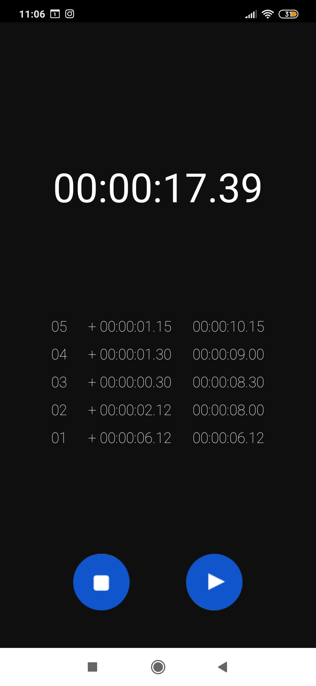

# mat|r Chronometer App
Data and code of Chronometer App, a mobile application developed with [mat|r script](https://www.matrproject.com/) for Android and iOS devices.

This app implements a precision timer. It indicates how long it took to perform a specific action and also indicates partial readings along with the total time.

**Programming Language:** mat|r script

**Test the App:** download the [mat|r Viewer](http://matrproject.com/docs/eng/viewer-eng/), a tool which allows you visualizing and testing the developed app instantly in compatible platforms. Visualize the app on your phone scanning the following QR code with mat|r Viewer:

**Author:** Agustina Dinamarca (agustinadinamarca@gmail.com)

